# Redis（Remote dictionary server）

## 主要内容

- 基本概念
- 安装配置
- 常用命令
- 十大数据类型
- 事务
- 数据持久化
- 主从复制
- 哨兵模式

---

## 简介

> Redis 是一个开源的基于内存的数据存储系统，它可以用作数据库（DB）、缓存（Cache）和消息队列（MQ）等各种场景
>
> 它也是目前最热门的 NoSQL 数据库之一
>
> 早期互联网公司的应用系统大多是通过 MySQL 这种传统的数据库来对外提供服务
>
> 随着互联网的快速发展，应用系统的访问量越来越大，数据库的性能瓶颈越来越明显，主要是磁盘 IO 所导致的
>
> 磁盘 IO 的读写操作速度与内存相比是非常慢的
>
> 如果能够把数据存储在内存中的话，就可以大大提高它的性能了
>
> 于是就有了 Redis 这种基于内存的数据存储系统
>
> Redis 支持多种数据结构，包括 5 种基本数据类型 和 5 种高级数据类型

**5 种基本数据类型**：

- 字符串 String
- 列表 List
- 集合 Set
- 有序集合 SortedSet
- 哈希 Hash

**5 种高级数据类型**：

- 消息队列 Stream
- 地理空间 Geospatial
- HyperLogLog
- 位图 Bitmap
- 位域 Bitfield

> Redis 的使用方式主要包括 3 种类型

- 命令行界面：CLI（Command Line Interface）
  - 通过 Redis-CLI 命令行工具来使用 Redis
- 应用程序接口：API（Application Programming Interface）
  - 使用 Java 或者 Python 等常用的编程语言，通过编写代码的方式来使用 Redis
- 图形用户界面：GUI（Graphical User Interface）
  - 通过一些图形化工具来使用 Redis，比如 RedisInsight

> 最主要的是 Redis 的性能非常地高
>
> 它和其他数据库相比，性能差了一个数量级
>
> 所以在互联网领域，Redis 是非常受欢迎的

**Redis 的优势**：

- 性能极高
- 数据类型丰富，单键值对最大支持 512M 大小的数据
- 简单易用，支持所有主流编程语言
- 支持数据持久化、主从复制、哨兵模式等高可用特性

---

## 安装配置

- wsl
- docker
- 本地安装

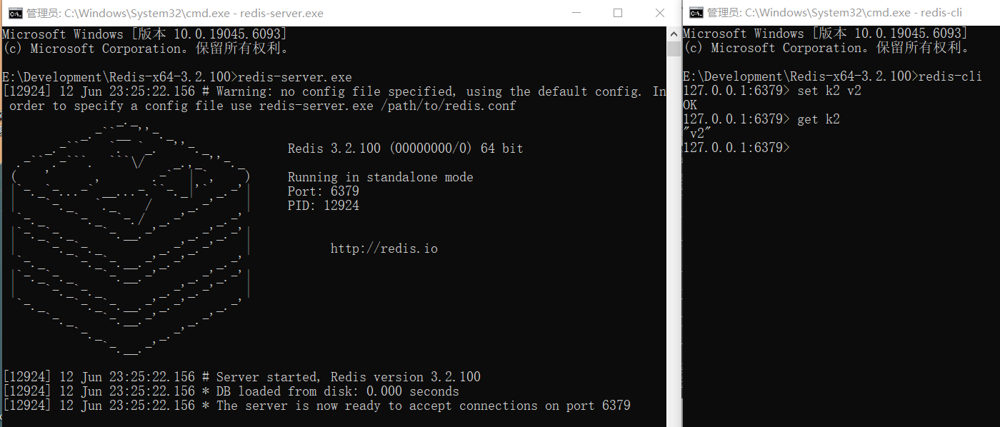

**RedisInsight**：

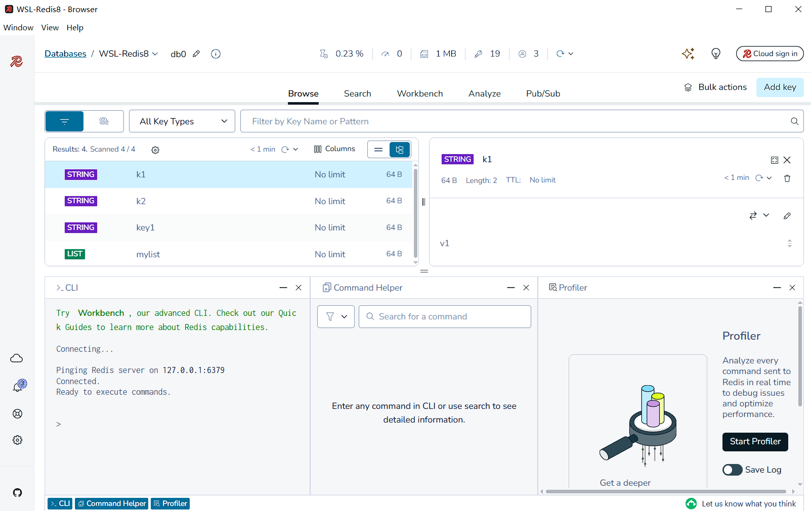

---

## 字符串 String

> Redis 中的数据是以键值对的形式存储的，所以我们需要指定一个键和一个值
>
> 键和值之间使用空格来分隔
>
> 可以使用 SET 命令来设置一个键值对
>
> 注意 Redis 中的键是区分大小写的
>
> Redis 中默认都是使用字符串来存储数据的，而且是二进制安全的
>
> 这就意味着可以把很多类型的数据都存储在 Redis 中，比如数字、布尔值，甚至是序列号之后的对象等
>
> 可以使用 DEL 命令来删除一个键，用 GET 命令获取被删除的键的值是 (nil)，表示这个键已经被删除掉了
>
> 可以使用 EXISTS 命令判断一个键是否存在（0 不存在，1 存在）
>
> 使用 KEYS 命令查看数据库中有哪些键，后面加上一个 pattern 模式匹配的字符串参数（* 表示查找所有的键，*me 表示查找所有以 me 结尾的键）

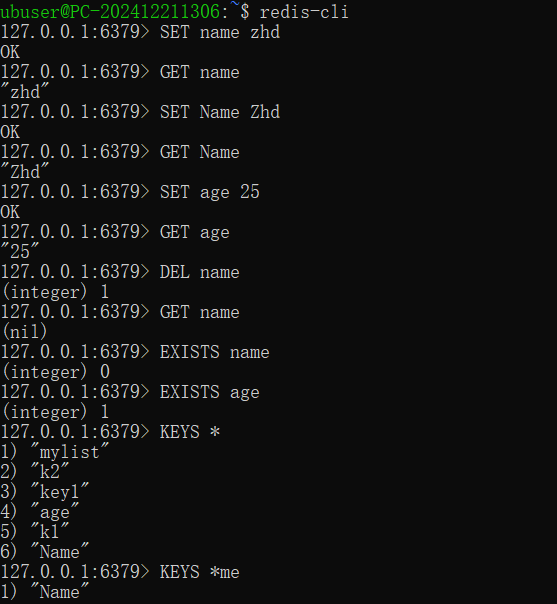

> 可以使用 FLUSHALL 命令把所有数据库里面的键都删除掉（慎用）
>
> Redis 中的键和值都是以二进制的形式存储的，所以默认不支持中文，会把中文换成二进制的形式（\x 表示后面的内容是十六进制的）
>
> 使用 quit 命令退出客户端，登录时加上 --raw 参数，表示以原始的形式来显示内容，就可以显示中文了
>
> 跟 Linux 一样可以用 clear 命令·清空·屏幕

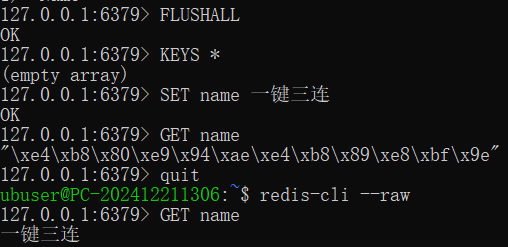

> 可以用 TTL（Time To Live，表示这个键还有多久过期）命令来查看一个键的过期时间，-1 表示没有过期时间
>
> 可以使用 EXPIRE 命令设置一个键值对的过期时间，-2 表示已经过期了
>
> 也可以使用 SETEX 命令来设置一个带有过期时间的键值对
>
> 还可以使用 SETNX 命令，只有当键不存在时才设置键的值，如果键已经存在，那么 不做任何动作

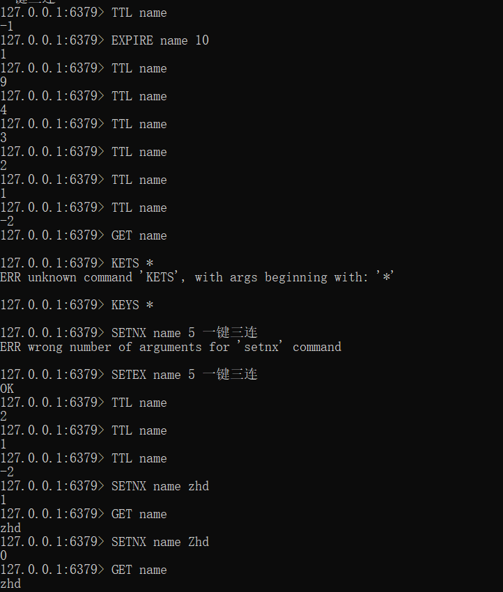

---

## 列表 List

> List 一般用来存储和操作一组有顺序的数据，和数组的概念比较类似
>
> 可以使用 LPUSH 或者 RPUSH 命令将元素添加到列表的头部或者尾部
>
> 如果想要获取列表内容的话，要使用 LRANGE命令：
>
> `LRANGE 列表名称 起始位置 结束位置`，起始位置和结束位置都是以 0 开始，-1 表示最后一个元素
>
> `LRANGE 列表名称 0 -1`就可以获取从第一个到最后一个，也就是列表中所有的元素
>
> LPUSH 也可以一次性添加多个元素，注意在列表中顺序是反过来的
>
> 因为 LPUSH 命令会把参数中的元素按照从左到右的顺序依次添加到列表的头部
>
> 所以最后添加的元素就会排在最前面
>
> 也可以使用 RPUSH 命令从列表的尾部添加元素

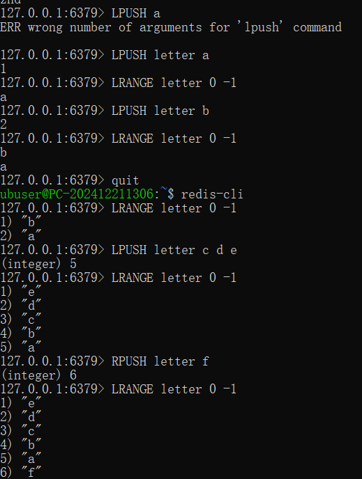

> 可以使用 LPOP 和 RPOP 命令来分别从列表的头部和尾部删除元素
>
> LPOP 和 RPOP 也可以一次性删除多个元素，后面加上数字表示要删除的元素个数：
>
> `LPOP/RPOP 列表名称 要删除的元素个数`
>
> 也可以使用 LLEN 命令查看列表的长度
>
> 这几个命令就可以实现一个简单的消息队列了：
>
> 使用 LPUSH 在列表头的方向添加一个元素，然后使用 RPOP 在列表尾部删除一个元素
>
> 这样就实现了一个最简单的先进先出队列
>
> 可以使用 LTRIM （trim 修剪）命令来删除列表中指定范围以外的元素，只保留 start 和 stop 之间的元素，不在这个范围内的元素都会被删除

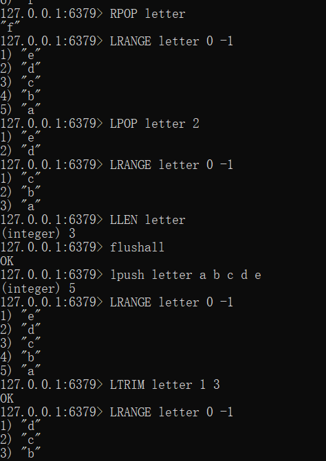

---

##  集合 Set

> SET 是一种无序集合
>
> 它和列表的区别在于：列表中的元素都是可以重复的，而 SET 中的元素是不可以重复的
>
> 而且 SET 中的元素并不像列表那样是具有顺序的
>
> SET 相关的命令都是以 S 开头的
>
> 比如可以使用 SADD 命令来向 SET 中添加一个元素，后面加上一个键表示集合的名称，然后是要添加到这个机会里面的元素，可以有一个，也可以有多个（1 添加成功，0 添加失败）
>
> 使用 SMEMBERS 命令查看集合中的元素
>
> 使用 SISMENBER 命令判断一个元素是否在集合中（1 在，0 不在）
>
> 使用 SREM 命令删除集合中的元素

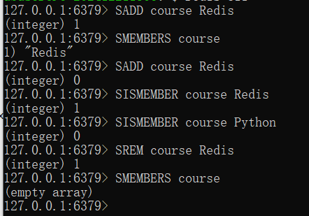

> Redis 支持集合的运算：交集、并集等
>
> SINTER、SUNION、SDIFF 等命令

---

## 有序集合 SortedSet

> SortedSet 也叫 ZSet，它和集合的区别是每个元素都会关联一个浮点类型的分数，然后按照这个分数来对集合中的元素进行**从小到大**的排序
>
> 有序集合的成员是唯一的，但是分数是可以重复的
>
> 有序集合的相关命令都是以 Z 开头的
>
> 可以使用 ZADD 命令来向有序集合中添加一个元素，后面加上键名和元素
>
> 每个元素都是由一个分数和一个成员组成，分数在前，成员在后，中间用空格隔开
>
> 使用 ZRANGE 命令查看这个有序集合中的元素，后面加上键名，然后是起始位置和结束位置，只输出成员
>
> 如果想要输出分数可以在命令后面加上 WITHSCORES
>
> 如果想要查看某个成员的分数的话，可以使用 ZSCORE 命令
>
> 如果想要查看某个成员的排名的话，可以使用 ZRANK 命令
>
> 排名默认从小到大，但是实际上一般的排名都是从大到小的，可以使用 ZREVRANK 命令

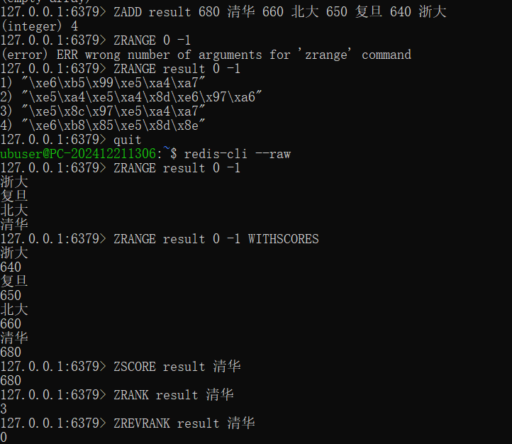

> 删除集合中的某个成员使用 ZREM 命令，使用 ZREMRANGEBYRANK 命令某个排名范围之内的成员
>
> 使用 ZINCRBY 命令对某个成员的分数进行增加
>
> 使用 ZRANGEBYSCORE 命令 查找某个分数范围之内的成员

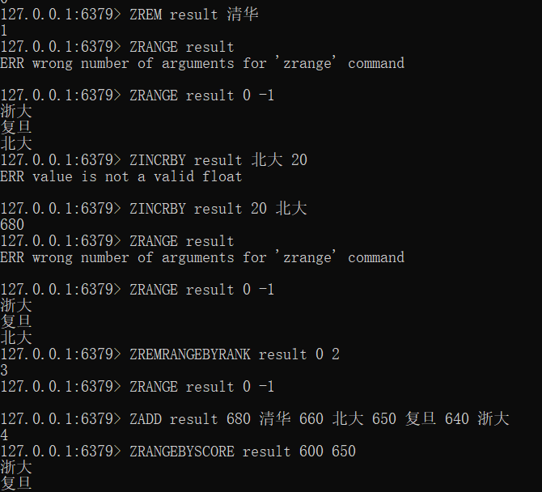

---

## 哈希 Hash

> 哈希是一个字符类型的字段和值的映射表，简单来说就是一个键值对的集合，特别适合用来存储对象
>
> 哈希相关的命令都是以 H 开头
>
> 可以使用 HSET 命令来向哈希中添加一个键值对，后面加上键名，然后是要添加的键值对
>
> 可以使用 HGET 命令来获取哈希中的某个键值对
>
> 可以使用 HGETALL 获取整个哈希中的所有键值对
>
> 可以使用 HDEL 命令删除哈希中的某个键值对
>
> 可以使用 HEXISTS 命令判断某个键值对是否存在（0 不存在，1 存在）
>
> 可以使用 HKEYS 命令获取哈希中的所有键，HVALS 获取所有值
>
> 可以使用 HLEN 命令获取哈希中所有键值对的数量

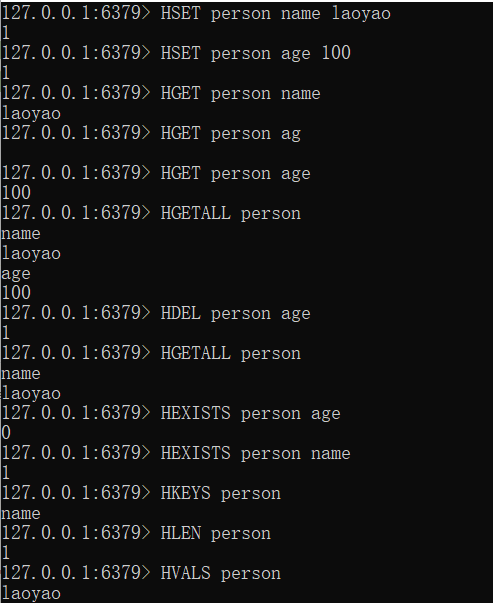

---

## 发布订阅模式

> Redis 提供了发布订阅的功能
>
> 可以通过 PUBLISH 命令将消息发送到指定的频道，后面加上频道的名称和消息的内容
>
> 可以通过 SUBSCRIBE 命令订阅这个频道，就可以接收到这个频道的消息了，订阅的频道终端可以有多个
>
> 但是发布订阅功能还有一些局限性，比如消息无法持久化、无法记录历史信息等，可以用 Stream 流来解决

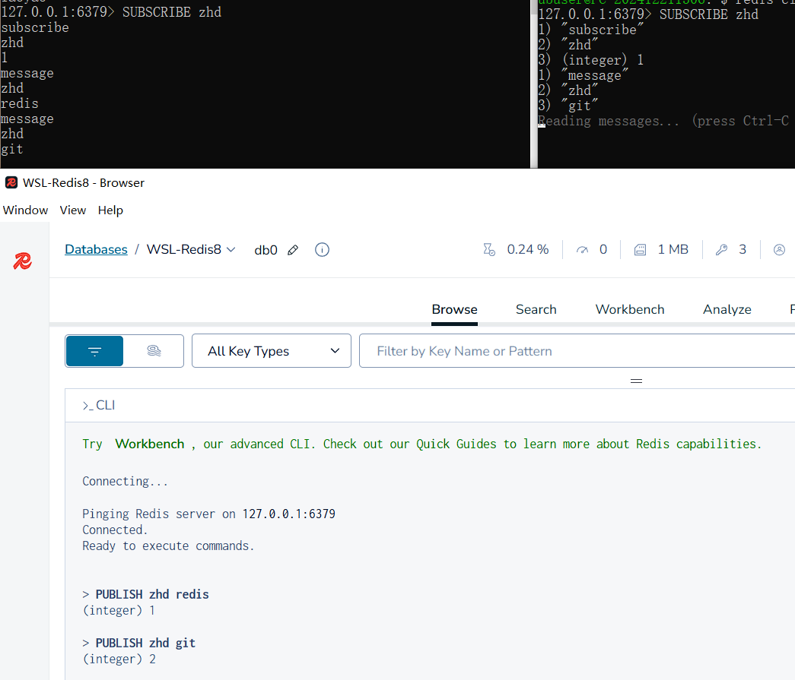

---

## 消息队列 Stream

> Stream 是 Redis 5.0版本中引入的一个新的数据结构，它是一个轻量级的消息队列
>
> 可以解决消息无法持久化、无法记录历史消息等问题
>
> Stream 相关的命令都是以 X 开头
>
> 可以通过 XADD 命令向 Stream 中添加消息，后面加上键名，* 表示自动生成一个消息的 ID（Redis 保证是生成的  ID 是自增的），然后是添加消息的名字和内容（键值对）
>
> 添加后的回显信息就是消息的 ID（可以手动加，ID 的格式是一个整数加上短横线，再加上一个整数；第一个整数表示时间戳，第二个整数表示一个序列号，需要自己保证 ID 的递增）
>
> 可以通过 XLEN 命令查看 Stream 中消息的数量
>
> 可以通过 XRANGE 命令查看 Sream 中的消息的详细内容，开始和结束可以使用 - 和 +
>
> 可以使用 XDEL 命令来删除消息，后面加上键名，然后是消息 ID
>
> 可以通过 XTRIM 命令删除消息，后面加上 MAXLEN 0 表示删除所有的消息

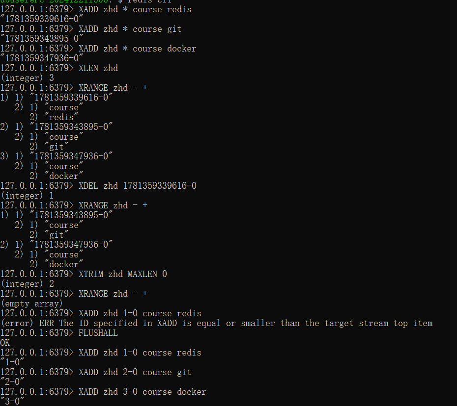

> 消息创建之后需要消费
>
> 可以使用 XREAD 命令读取消息，后面加上 COUNT，比如 COUNT 2 表示一次读取两条消息；然后加上 BLOCK 1000 表示没有消息的话就阻塞 1000 ms（1 秒）；然后加上 STREAMS，后面加上消息队列的名称，0 表示从头开始读取（如果是比消息队列中最大的 ID 还大的一个值，会阻塞 1 秒返回 nil），$ 只希望获取从现在开始以后的最新消息）
>
> 消息可以重复读取

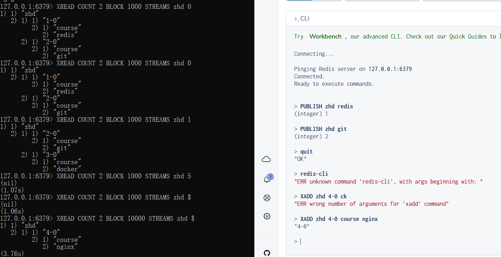

> 还可以使用 XGROUP 命令创建一个消费者组，在消费者组中添加消费者，后面加上 CREATE，然后加上消息的名称，后面是组的名称，然后是一个 ID
>
> 可以通过 XINFO GROUPS 命令查看消费者组的信息，会返回组的名称、消费者的数量、待处理的消息数等
>
> 可以使用 XGROUP CREATECONSUMER 命令添加消费者，然后加上消息的名字、组的名字，之后是消费者的名字
>
> 可以通过 XREADGROUP 命令读取消息，后面是组的名称、消费者的名称，然后加上消息的数量，COUNT 2 表示一次读取两条消息，后面是 BLOCK 加阻塞的时间，最后是消息的名字（频道的名字），右箭头（>）表示从这个消息中读取最新的消息，回车后两条消息就被消费了

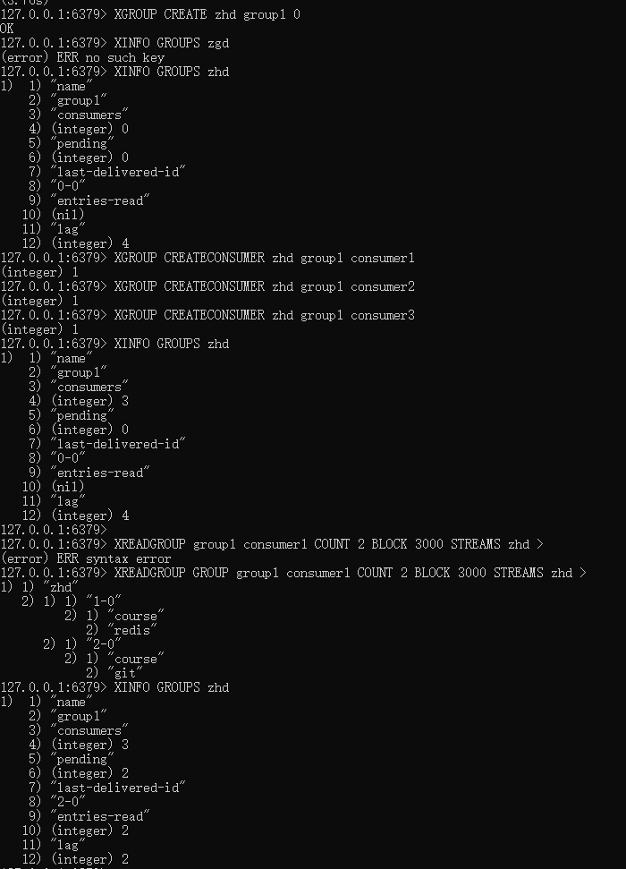

---

## 地理空间 Geospatial

> Geospatial 是 Redis 3.2版本中的新特性
>
> 它提供了一种存储地理位置信息的数据结构
>
> 同时支持对地理位置进行各种计算操作，比如计算两个位置之间的距离，或者某个地理位置的经纬度，查找附近的人等
>
> 地理位置相关的命令都以 GEO 开头
>
> 可以使用 GEOADD 命令添加，后面的 key 表示这个地理位置信息的名字，然后加上经度和纬度，再后面是城市的名字
>
> 也可以一次性添加多个地理位置信息
>
> 可以使用 GEOPOS 命令获取某个地理位置的经纬度，第一个是经度，第二个是纬度
>
> 可以使用 GEODIST 命令计算两个地理位置之间的直线距离（默认单位：米，后面加 KM 就是千米）
>
> 可以使用 GEOSEARCH 命令搜索指定范围内的成员并返回，这个范围可以以成员的位置或者一个指定的经纬度为中心，按照圆形或者矩形的范围来搜索；FROMMEMBER 后面加上一个地理位置的名字；BYRADIUS 表示一个圆形的范围，后面加上这个范围的半径；BYBOX 表示一个矩形的范围

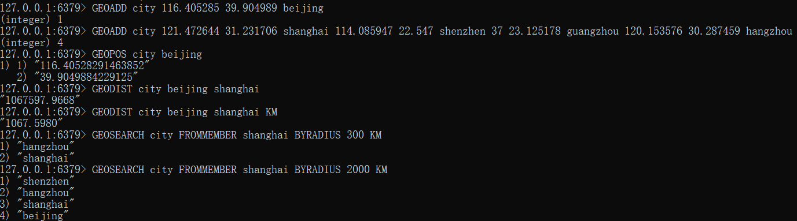

> 还可以使用 GEORADIUS 或者 GEORADIUSBYMEMBER 命令来实现同样的功能

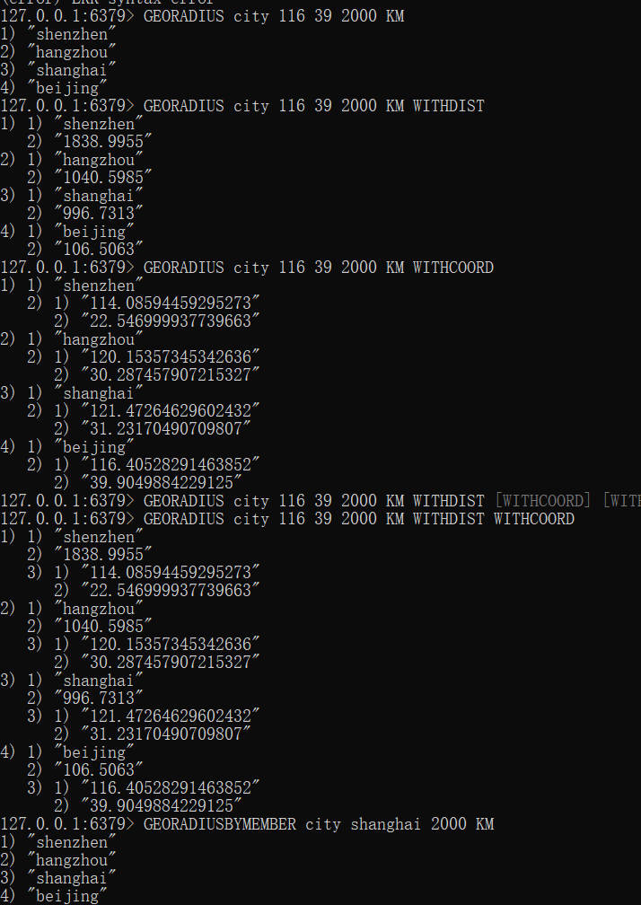

---

## HyperLogLog

> HyperLogLog 是一种用来做基数统计的算法
>
> 它并不是 Redis 特有的算法
>
> 如果集合中的每个元素都是唯一且不重复的，那么这个集合的基数就是集合中元素的个数，{1, 2, 3, 4, 5} 的基数是 5，{1, 2, 3, 4, 5, 1, 2, 3, 4, 5} 还是 5
>
> HyperLogLog 算法就是用来计算这个基数的
>
> 它的原理是使用随机算法来计算，通过牺牲一定的精确度来换取更小的内存消耗
>
> 优点就是占用内存小，相应的缺点就是会有一定的误差
>
> 所以它适合用来做一些对精确度要求不高而且数据量非常大的统计工作
>
> 比如统计某个网站的 UV，统计某个词的搜索次数等
>
> 它的命令都以 PF 开头
>
> 可以通过 PFADD 命令添加一个元素
>
> 可以使用 PFCOUNT 命令查看基数
>
> 可以使用 PFMERGE 命令合并多个 HyperLogLog

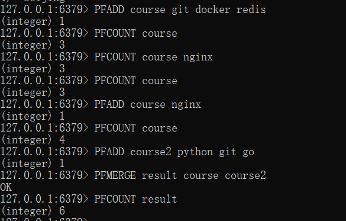

---

## 位图 Bitmap

> 位图是字符串类型的扩展，本质上就是一个字符串
>
> 可以使用一个 String 类型来模拟一个 Bit 数组，数组的下标就是偏移量，值只有 0 和 1
>
> 也支持一些位运算，比如与、或、非、异或等
>
> 应用场景非常广泛，比如可以记录用户的签到情况、在线状态、有没有点赞等
>
> 位图所有的命令都以 BIT 为主
>
> 可以使用 SETBIT 来设置某个偏移量的值，后面加上键名，比如可以在偏移量为 0 的位置设置为 1
>
> 可以使用 GETBIT 命令获取某个偏移量的值
>
> 可以直接使用字符串的命令 SET 来设置它的值，有一个小技巧：可以使用十六进制来表示一个二进制的数，比如`\xF0`表示`11110000`，这样就可以一次性设置多个位的值
>
> 可以使用 BITCOUNT 命令来统计某一个 key 的值里面有多少个 bit 是 1
>
> BITPOS 命令可以获取某个 key 里面第一个出现的 0 或 1 的位置，后面可以加上起始位置和结束位置指定范围

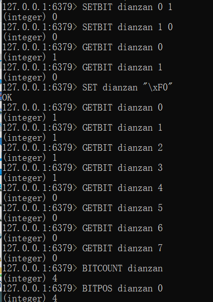

---

## 位域 Bitfield

> 位域可以将很多小的整数存储到一个较大的位图中，这样就可以更加高效地使用内存
>
> 比如可以用位域来记录每个玩家在游戏中的一些关键信息：每个用户的金钱、等级、是否在线等
>
> 可以用 BITFIELD 命令，后面加上键名（比如表示游戏 ID），然后加上 set，后面是 U8 类型的整数（8 位无符号的整数，表示游戏等级），#0 表示第一个位置
>
> 可以使用 GET 命令查看内存中现在的情况（`\x01`十六进制的 01，表示等级为 1），可以使用 BITFIELD …… get …… 获取游戏等级
>
> 可以使用 U32 来表示金钱，#1 表示第二个位置
>
> 可以使用 BITFIELD …… incrby …… 增加金钱、等级

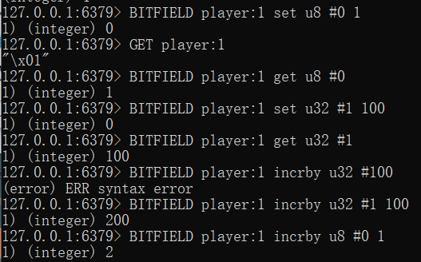

---

## Redis 事务

> Redis 支持事务，也就是可以在一次请求中执行多个命令
>
> Redis 中的事务主要是通过 MULTI 和 EXEC 这两个命令实现
>
> MULTI 命令用来开启一个事务
>
> 事务开启之后，所有的命令就都会被放入到一个队列中
>
> 最后通过一个 EXEC 命令来执行事务中的所有命令
>
> Redis 中的事务跟关系型数据库比如 Oracle 是不太一样的
>
> 在关系型数据库中，事务一般是一个原子操作，要么全部执行成功，要么全部执行失败
>
> 而在 Redis 中，事务并不能保证所有的命令都会执行成功
>
> 它的执行结果取决于事务中的命令
>
> 但是 Redis 可以保证以下 3 点：
>
> 1. 在发送 EXEC 命令之前，所有的命令都会被放入到一个队列中缓存起来，不会立即执行
> 2. 在收到 EXEC 命令之后，事务开始执行；事务中的任何一个命令执行失败，其他命令依然会被执行，不会因为某一个命令执行失败，而导致其他命令不会被执行的这样的情况发生
> 3. 在事务执行的过程中，其他客户端提交的命令请求，并不会被插入到事务的执行命令序列中
>
> 使用 MULTI 命令后，会进入事务模式（TX）
>
> 比如我们输入设置键值对的命令后，不会提示 OK，而是 QUEUED，表示命令已经被放入到队列中，这时候是获取不到值的（最好用另一个终端），因为事务还没有执行
>
> 可以通过 EXEC 命令来执行事务，执行之后事务就结束了
>
> 如果在事务执行过程中，某一个命令执行失败了，并不会影响后面的命令，依然会被执行
>
> 比如可以设置键值对，一种值是整数类型，一种是字符类型，当使用 INCR 命令进行自增就会出现错误，字符类型不能被解析成整数
>
> 这就是一个最简单的 Redis 事务的执行过程

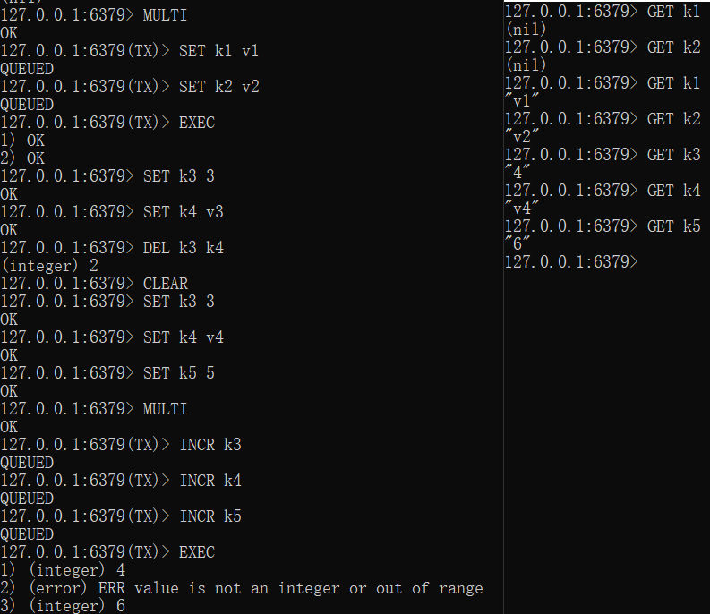

---

## Redis 持久化

> 持久化是 Redis 中一个非常重要的功能
>
> 因为 Redis 是一个基于内存的数据库
>
> 如果没有持久化的话，一旦服务器重启或断电，那么之前所有的数据都会丢失
>
> 这对一个数据库来说是非常致命的，持久化就是为了解决这个问题出现的
>
> Redis 中的持久化主要有两种方式：
>
> - RDB（Redis Database）
> - AOF（Append Only File）
>
> RDB 在指定时间间隔内，将内存中的数据快照写入磁盘，它是某一个时间点上数据的完整副本
>
> 可以通过配置文件中的 save 参数来配置，后面的参数是时间和修改次数的组合，第一个参数表示秒数，第二个参数表示修改次数
>
> 默认配置就是 `save 3600 1 300 100 60 10000`，第一部分表示一个小时之内只要有一次修改就进行一次快照，第二部分表示300 秒内有 100 次修改的话才进行一次快照，第三部分表示 60 秒内有 1 万次修改的话才进行一次快照
>
> 可以根据自己服务器的负载情况来调整

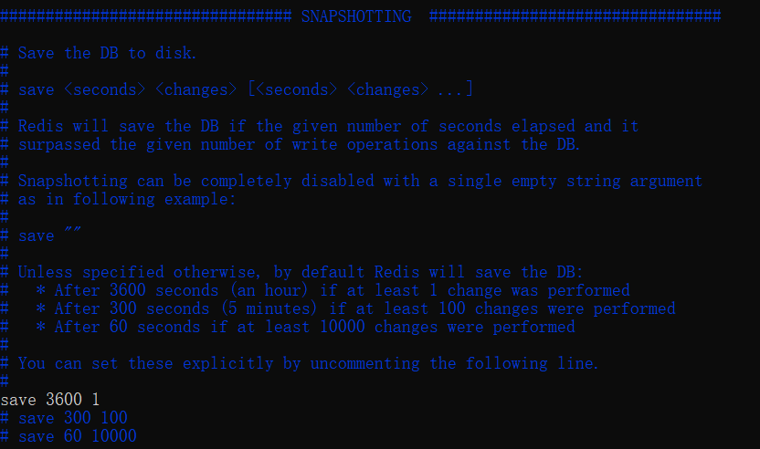

> 除了使用配置文件来自动触发快照之外，还可以使用 save 命令来手工触发快照，dump.rdb 就是快照文件
>
> tips：这里的 xdd 是一个可以查看二进制或十六进制文件内容的 Linux 命令。可以看到 rdb 文件中的内容
>
> 快照文件有个缺点：如果服务器在快照之后宕机了，那么最后一次快照之后的所有修改内容都会丢失掉
>
> 所以 RDB 更适合用来做备份
>
> 比如可以可以在每天凌晨通过 crontab 命令执行一次 save 命令，然后将快照文件备份到其他地方，这样就可以保证数据的安全了
>
> 还有一个问题：由于生产环境中，我们为 Redis 开辟的内存区域一般都比较大
>
> 那么内存中的数据同步到硬盘这个过程就会持续比较长的时间
>
> 这段时间内 Redis 都是处于一个阻塞的状态，不能接受任何请求
>
> 这样显然是不行的，于是 Redis 又提供了一个 bgsave 命令
>
> 这个命令会单独创建一个子进程，负责将内存中的数据写入到硬盘中
>
> 这样主进程就可以继续处理请求了，但是这个过程中还会有一定的性能损耗
>
> 因为 fork 一个子进程也是需要时间的
>
> 这段时间内 Redis 还是不能处理任何请求，没有办法做到秒级的快照
>
> 为了解决这个问题，Redis 又提供了另一种叫做 AOF 的持久化方式

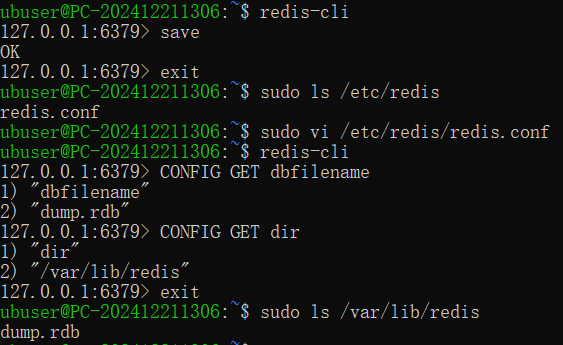

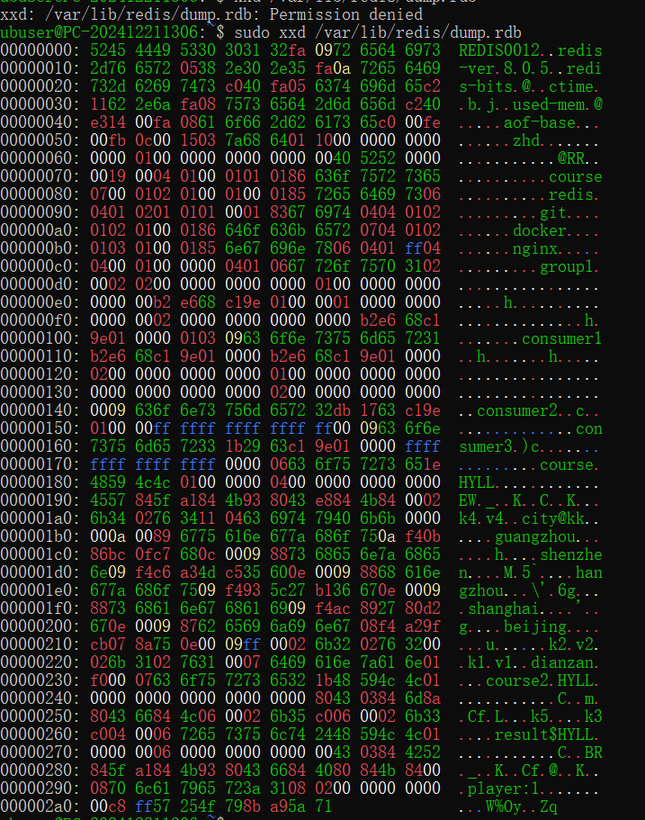

> AOP 意思是追加文件
>
> 它的原理是在执行写命令的时候，不仅会将命令写入到内存中，还会将命令写入到一个追加的文件中
>
> 这个文件就是 AOF 文件，它会以日志的形式来记录每一个写操作
>
> 当 Redis 重启的时候，就会通过重新执行 AOF 文件中的命令，来在内存中重建整个数据库的内容
>
> 开启 AOF，只需要在配置文件中，将 append only 这个参数的值改成 yes 就可以了

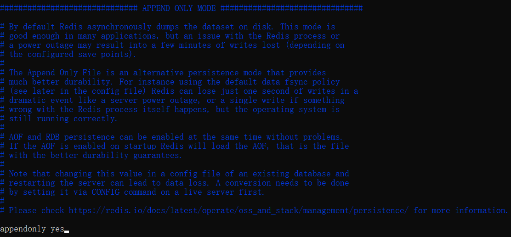

---

## 主从复制

> 主从复制是指将一台 Redis 服务器的数据复制到其他 Redis 服务器，也叫主节点（master）和从节点（slave）
>
> 一个主节点可以有多个从节点，而每个从节点只能用一个主节点
>
> 数据的复制是单向的，只能由主节点到从节点
>
> 一般来说，主节点负责写操作，从节点负责读操作
>
> 主节点会将自己的数据变化，通过异步的方式发送给从节点
>
> 从节点接收到主节点的数据之后，更新自己的数据
>
> 这样就达到了数据一致的目的
>
> 主节点不需要修改任何配置，因为默认的配置就是主节点，只需要修改从节点的配置就可以了
>
> 修改的方式有两种，一种是通过命令行执行命令，另一种是通过配置文件来修改
>
> 命令配置方式 tips：
>
> - 查看当前节点角色：role
> - 配置所属主节点：replicaof host port 或者 slaveof host port（旧版）
>
> 命令行就是使用 slaveof 命令直接指定主节点的 IP 和端口，这种方式不常用
>
> Redis 的配置文件是 redis.conf 这个文件，直接把这个配置文件复制到根目录一份作为主节点的配置文件
>
> 回到根目录再复制一个 6380 的文件，把它作为从节点的配置文件，6380 就是我们待会要使用的从节点的端口号
>
> 在从节点配置文件里面把端口号改成 6380，然后把 pidfile 这个配置项也改成 6380,
>
> PID 就是进程 ID，为了和主节点的配置文件区分开，我们把文件名也加上端口号
>
> Redis 是以守护进程的方式运行的，系统默认会把 pid 写入到这个文件里面
>
> 因为这里要启动多个 Redis 服务，所以要把两个 Redis 的 pid 文件区分开
>
> 再找到 dbfilename 这个配置项，把文件名也加上端口号
>
> 这个就是我们说的持久化文件了
>
> 当我们执行 save 或 bgsave 命令的时候，就会把内存中的数据保存到这个文件里面
>
> 为了区分开主节点和从节点的数据，我们也要把这个文件名加上端口号
>
> 最后再找到 replicaof 这个配置项，它是用来指定主节点的，默认是注释掉的
>
> 复制一行加到下面，把 IP 地址改成 127.0.0.1，端口号改成 6379，表示现在配置的这个节点是 6379 这个库的从节点

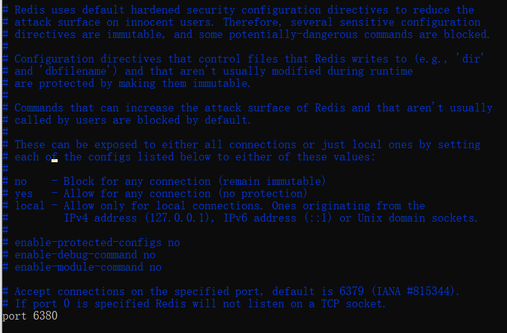

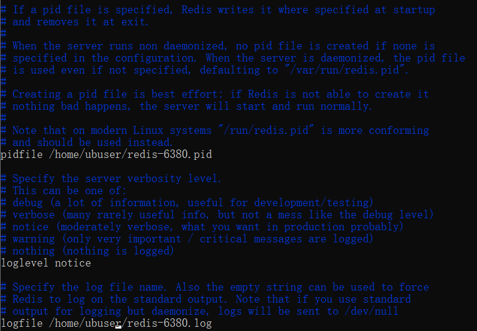

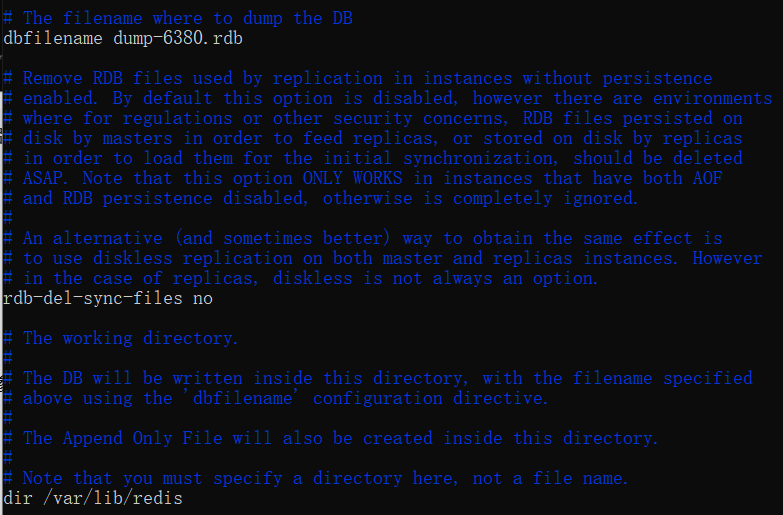

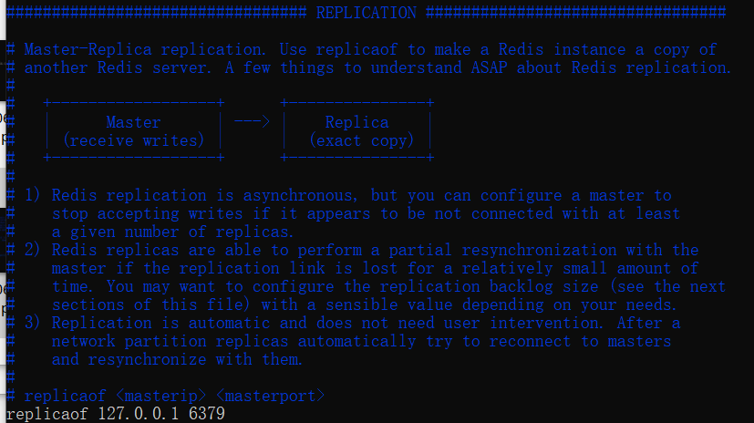

> 打开一个新的终端来启动一下这个从节点
>
> 连接成功之后，可以使用 info replication 命令查看信息
>
> 可以看到 role:slave 表示这是一个从节点，对应的主节点端口号是 6379
>
> 这样就表示主从复制已经配置成功了

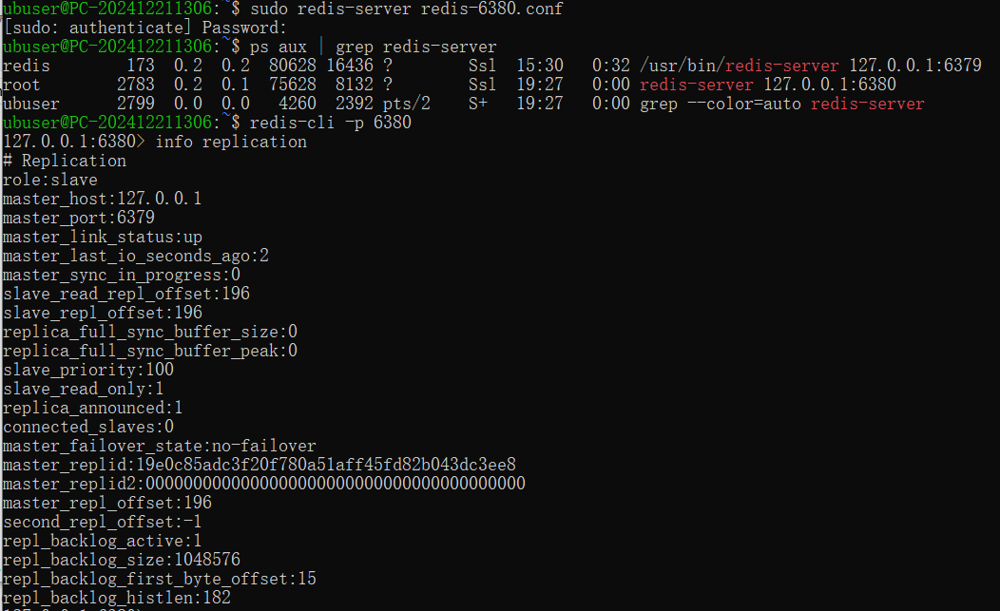

> 再打开一个终端连接主节点，使用 keys * 命令查看数据是否一致
>
> 可以发现从节点的数据跟主节点是一样的
>
> 在主节点添加一个新值，从节点也能看到
>
> 这是主从复制的一个简单演示，我们并没有在从节点添加任何数据，但是从节点跟主节点的数据是一样的
>
> 主节点的数据变化会自动同步到从节点上

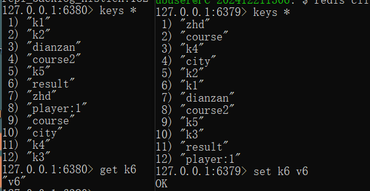

> 当然从节点也可以配置多个，可以再复制一份 6381，然后在 vi 编辑器 将 6380 替换为 6381，回车后提示多少个位置发生变化
>
> 这样我们就完成了一个简单的一主两从的配置

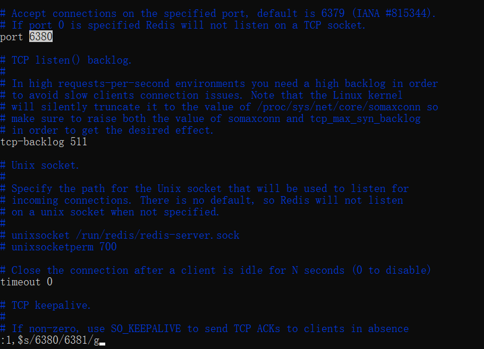

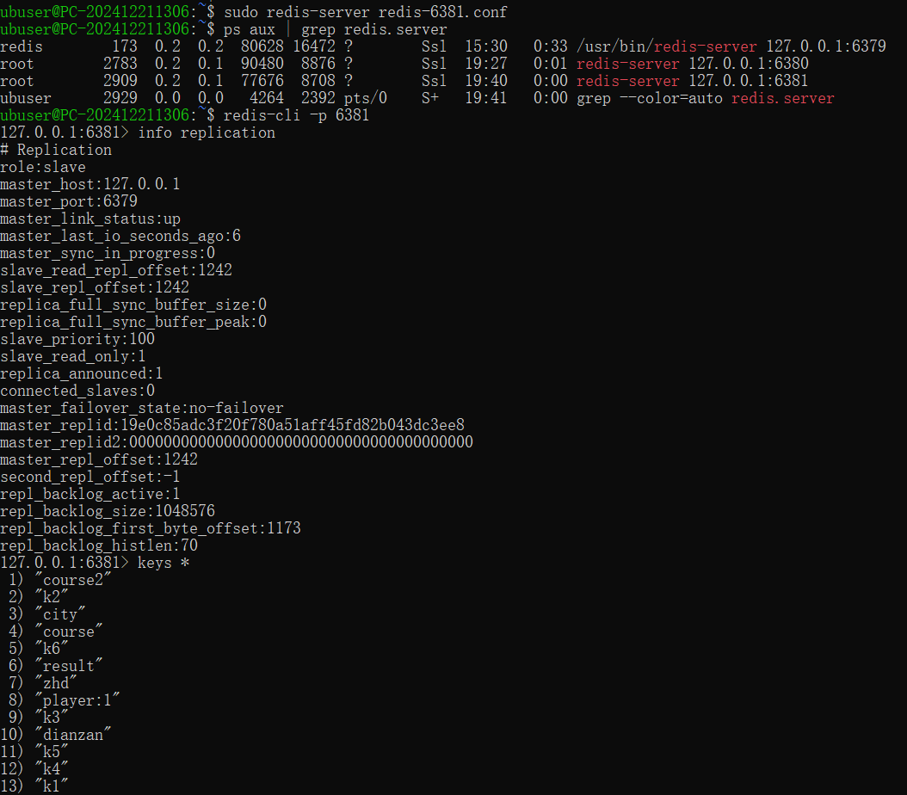

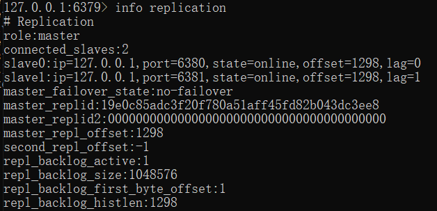

---

## 哨兵模式 Sentinel

> 一个一主两从的 Redis 集群实现了一定程度上的高可用
>
> 相比一个单节点的 Redis 来说，已经有很大的提升
>
> 但是这个集群还是有一些问题，主节点宕机了，我们还是需要手工去把另一台从节点提升为主节点，需要人工干预
>
> 这样就不能实现真正的高可用
>
> 哨兵模式可以实现自动的故障转移
>
> 哨兵会以一个独立的进程运行在 Redis 集群中，用来监控 Redis 集群中的各个节点是否运行正常
>
> 它主要用来执行下面几个功能：
>
> 1. 监控：通过不断第发送命令来检查 Redis 节点是否正常
> 2. 通知：如果发现某个节点出了问题，哨兵就会通过发布订阅模式来通知其他节点
> 3. 自动故障转移：当主节点不能正常工作的时候，哨兵会开始一个自动故障转移的操作，它会将一个从节点升级为新的主节点，然后再将其他从节点指向新的主节点
>
> 配置哨兵模式，首先需要在 Redis 集群中添加一个哨兵节点
>
> 可以使用 redis-sentinel 命令来启动哨兵节点，这里需要添加一个配置文件，文件名为 sentinel.conf
>
> 配置内容：
>
> sentinel monitor master（要监控的主节点的名称）IP地址 端口号 1（只需要一个哨兵同意就可以进行故障转移了）
>
> 启动哨兵节点：
>
> redis-sentinel sentinel.conf

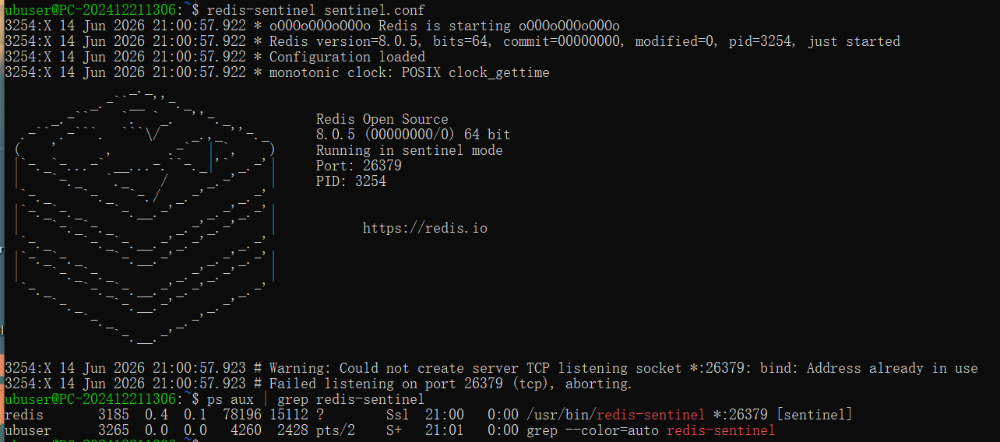

> 接下来停止 6379 这个服务端来模拟主节点宕机的情况，新的主节点变成 6380
>
> 这样就完成了一次自动故障转移
>
> 注意哨兵本身也是一个进程，它自己也会有单节点故障的问题
>
> 所以一般在实际的生产环境中，会使用 3 个哨兵节点来保证高可用
>
> 这 3 个哨兵节点会通过选举的方式来选出一个领导者
>
> 然后由领导者来监控其他节点
>
> 如果领导者挂了，那么其他哨兵节点会重新选举出一个领导者
>
> 这样就可以保证哨兵节点的高可用了

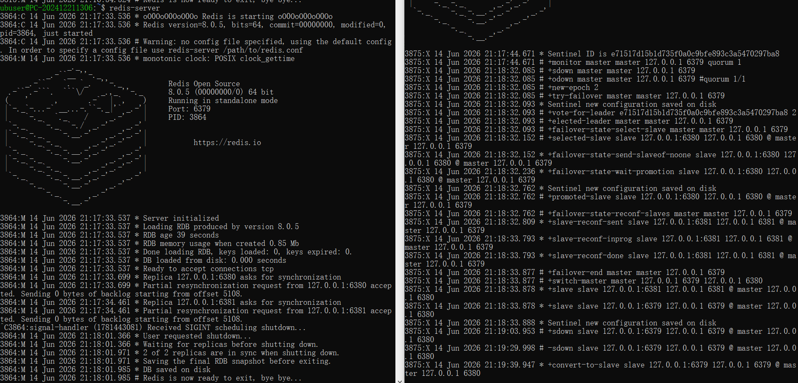

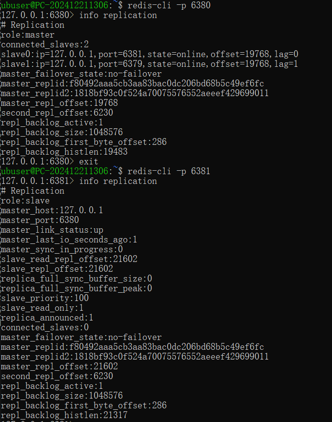
