# Shell

## 简介

> Shell 是一个命令行解释器，负责接收用户输入的命令
>
> 然后调用操作系统的内核去执行这些命令，再把执行的结果返回给用户
>
> Shell 有很多种类，常见的有 Bourne Shell（sh）、Bourne Again Shell（bash）、C Shell（csh）、Korn Shell（ksh）以及 Z Shell（zsh）
>
> Windows 系统上也有微软自己的命令提示符，以及 PowerShell 等
>
> 不同的 Shell 版本之间会存在一些比较微妙的差异
>
> 但是大部分的命令基本上都是通用的
>
> 在 Linux 系统中默认安装的一般都是 Bash，我们以 Bash 为例理解 Shell
>
> Windows 可以使用自带的子系统 WSL 来安装一个 Linux，或者安装一个 Git 的客户端（自带轻量的 GitBash）
>
> 可以打开终端输入各种命令，这些命令就会被 Shell 解释并执行
>
> 可以通过 cat 命令查看 /etc 目录下的 shells 文件
>
> 这个文件记录了系统中所有的 Shell 版本
>
> 可以通过系统的环境变量查看当前系统默认使用的是哪个 Shell
>
> 在 Linux 中有很多环境变量，用来存储一些系统的配置信息
>
> 比如 $HOME 用来存储当前用户的家目录，$PATH 用来存储系统的查找路径
>
> 也就是系统会在这些路径中查找各种命令的执行文件
>
> 而 $SHELL 就是用来存储当前系统默认使用的 Shell 的路径的
>
> 可以通过 echo 命令来查看这些环境变量的值
>
> 还可以使用 $0 来查看当前正在执行的脚本的名称
>
> 注意 $SHELL 和 $0 还是有一些区别的
>
> $SHELL 是系统环境变量，而 $0 是当前正在执行的脚本的名称
>
> 当我们切换到其他的 Shell 版本的时候，$SHELL 并不会变化，但是 $0 就会变成其他的 Shell 版本名称了

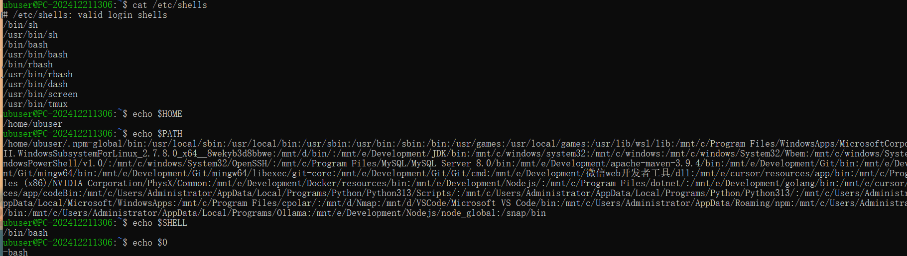

> 可以使用 /bin/sh 就可以切换到 Bourne Shell（sh）这个版本
>
> 退出使用 exit 命令

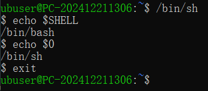

---

## Shell-01 内核

> 前面说到 Shell 是一个命令行解释器，负责接收用户输入的命令
>
> 然后调用操作系统的内核去执行这些命令，再把执行的结果返回给用户
>
> 这种交互式的方式，对于一些简单的操作来说是非常方便的
>
> 但是如果要执行一些复杂的操作，或者需要重复执行一些命令的时候
>
> 这样的方式就显得比较麻烦
>
> 比如需要在凌晨的时候自动备份数据
>
> 或者需要定时清理一些日志文件等
>
> 这个时候我们就可以把想要执行的命令写入到一个文件中
>
> 然后再通过执行这个文件来一次性执行所有的命令
>
> 这个文件就是一个 Shell 脚本，它可以用来编写一些自动化的任务
>
> 比如安装软件、备份数据、系统的运维巡检等

> 接下来编写一个最简单的 Shell 脚本
>
> 首先使用文本编辑器来新建一个文件，比如 vi
>
> Shell 脚本文件的扩展名一般以 .sh 结尾，其实这只是一个约定俗成的规范
>
> 脚本文件可以是任何的扩展名称，甚至可以没有扩展名
>
> 但是一般来说还是建议使用 .sh 作为扩展名
>
> 这样一眼就知道这是一个 Shell 脚本文件
>
> Shell 脚本文件第一行一般是一个 #!，后面加上一个 /bin/bash，表示这个脚本文件使用的是 Bash 解释器
>
> 这样当我们执行这个脚本文件的时候，系统会自动调用 Bash 来解释执行
>
> 当然如果想要使用其他 Shell 解释器的话，可以把 /bin/bash 替换成其他 Shell 解释器的路径
>
> 然后我们可以在文件输入一些命令，这些命令就会按照顺序依次执行
>
> 比如用 echo 命令打印信息
>
> 用 date 命令显示当前的日期和时间
>
> 用 whoami 命令显示当前用户名称的命令
>
> 保存后执行这个脚本，执行方式：`./脚本文件名称`
>
> 注意在 Linux系统中，想要执行一个文件必须要有执行权限
>
> 可以使用 chmod 命令给这个文件添加一下执行权限，然后再来执行这个脚本文件
>
> 这就是一个最简单的脚本的执行过程

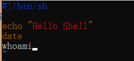

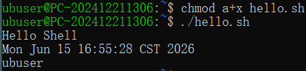

>Shell 脚本的功能是非常强大的
>
>它支持分支、条件判断和循环等很多在编程语言中才有的特性
>
>也可以定义函数和变量，可以调用系统命令以及其他程序
>
>还可以进行文件的读写等操作，是一个非常强大的工具，可以大大提高工作效率
>
>接下来用 ai 生成一个 Shell 脚本

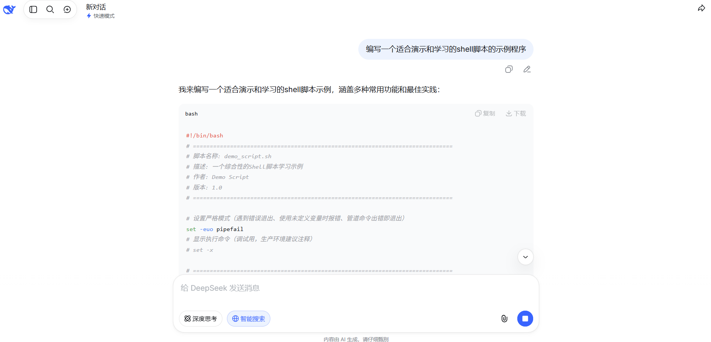

>Shell 脚本是支持函数的，变量默认是全局的，这点是和 C++ 或者 Java 这些高级语言不太一样的地方
>
>它的作用域是从定义的地方开始一直到脚本结束
>
>如果想要在函数中定义一个局部变量的话，就需要在变量前面加上一个 local 关键字
>
>这样它的作用域就只在函数内部有效了 $1 表示函数的第一个参数，也就是我们要检查的数字
>
>脚本中if 语句的写法是比较严格的， 两个中括号`[ ]` 两边都需要有空格
>
>否则会因为语法错误而无法执行
>
>lt（less then）是小于的意思、gt（greater then）是大于、eq（equal to）等于、le（less then or equal to）小于等于、ge（greater  then or equal to）大于等于、ne（not equal to）不等于
>
>for 循环的格式也是比较严格的，这里用来检查从 2 到 这个数的平方根之间的所有数字，看看这个数能不能被整除，如果能被整除就不是素数
>
>使用两个小括号`(())`把里面的三个表达式都是都括起来，这个同其他语言的 for 循环也是比较类似的

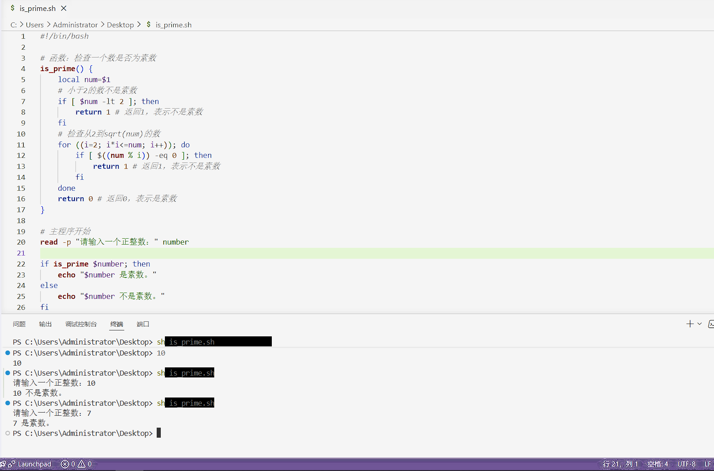

> 这就是一个关于脚本的简单示例，它里面包含了一些 Shell 脚本的基本语法和功能
>
> 比如使用 # 开头的行表示的注释、如何定义和调用一个函数、如何使用 read 命令来读取用户的输入、如何使用 if 语句来进行条件判断，以及如何使用 for 语句来进行循环操作等
>
> 这些都是 Shell 脚本中非常常用的一些功能

---

## Shell-02

> 前面我们了解了 Shell 的一些基础知识和基本概念
>
> 接下来从头开始编写一个猜数字的小游戏
>
> 可以使用 nano 进行编辑
>
> 可以使用 echo 提示输入用户名
>
> 然后使用 read 命令读取用户的输入，再把输入的内容赋值给一个变量 name

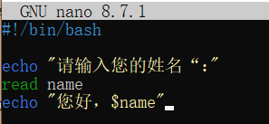

> ./ 和 bash 这两种执行方式还是有区别的
>
> 前者需要给这个脚本文件添加一个执行权限：chmod +x 脚本文件名
>
> 这样就完成了一个最简单的交互式脚本文件的编写和执行的过程

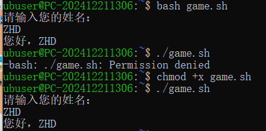

> 除了使用 read 命令来交互地读取用户的输入以外，也可以给这个脚本文件传递一些参数
>
> 这些参数可以在脚本文件中使用 $ 加上数字序号的方式来引用（$1，$2，$3等，$0 表示当中正在执行的脚本文件的名称，$1、$2、$3 就表示传递给这个脚本的第一个、第二个和第三个参数）
>
> 这样我们就能通过参数来给脚本文件传递一些信息
>
> 当我们不能交互式地输入或者需要自动化地执行一些操作的时候，这种方式非常有用

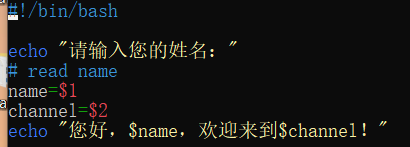

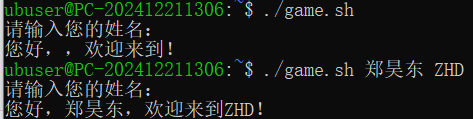

> 这里每次执行脚本都需要输入用户名和频道名称有点麻烦
>
> 我们可以把这些信息保存到环境变量中，让脚本文件自动读取这些信息，这些变量是系统预先定义好的
>
> 我们也可以自定义一些变量，可以在命令行中使用赋值的方式来定义 name 和 channel 这两个变量
>
> 但是结果并没有像预料的那样输出用户名和频道
>
> 我们确实在命令行定义了这两个变量，但是它们只是普通变量，并不属于环境变量
>
> 它们也只是在当前的 Shell 会话中有效
>
> 在脚本文件中直接引用的话，是无法获取到它们的值的
>
> 解决方案是使用 export 命令把这两个变量转换为环境变量

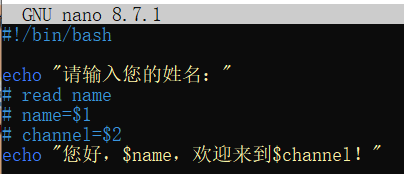

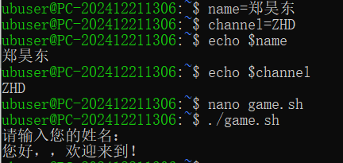

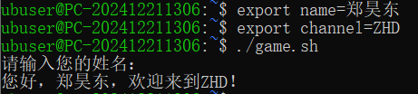

> 另外还有一个经常遇到的问题：
>
> 使用 export 定义的环境变量只在当前的 Shell 会话中有效，使用 exit 命令退出之后就会失效
>
> 使用 echo 查找也是空的，说明这两个变量已经失效了
>
> 可以使这些环境变量永久生效，Shell 在启动的时候会读取一些配置文件
>
> 最常见的就是用户家目录下的 .bash_profile 和 .bashrc 这两个文件
>
> 这两个文件可以用来存储一些环境变量
>
> 不过 .bash_profile 只是在用户登录的时候执行的并且只执行一次
>
> 而 .bashrc 是在每次新打开一个终端或者新建一个 Shell 会话的时候执行的
>
> 不同 Shell 的配置文件可能会有一些差异
>
> 比如 zsh 配置文件是 .zshrc，fish 是 config.fish
>
> 但是原理基本上是相同的
>
> 通常 .bash_profile 里面会调用 .bashrc
>
> 所以一般推荐把环境变量放到 .bashrc 文件中
>
> 这样就可以保证每次新打开一个终端的时候，都可以获取到这些环境变量了
>
> 除了用户家目录下的这两文件，系统根目录下也会有一些系统级别的配置文件
>
> 比如根目录 etc 文件夹下的 profile 和 bashrc 文件等
>
> 这些文件里面存储的环境变量是对所有用户都有效的
>
> 接下来把 name 和 channel 这两个文件放到 .bashrc 里
>
> 注意修改完 .bashrc 后需要使用 source .bashrc 或者 . .bashrc 来重新加载一下这个文件，或者直接退出当前 Shell 会话

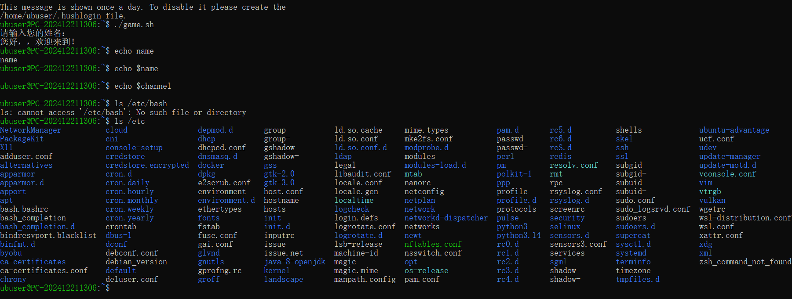

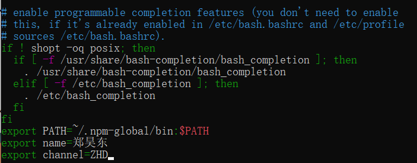

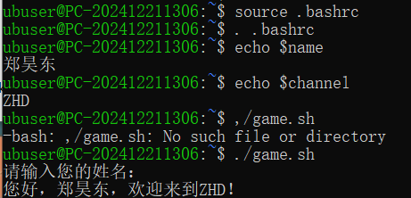

> .bashrc 除了可以存储环境变量之外，还可以定义一些别名来简化一些命令的使用
>
> 比如在默认的 .bashrc 中就定义了 ls 命令的一些别名，包括 ll、la、l 等
>
> 当然也可以定义一些自己的别名

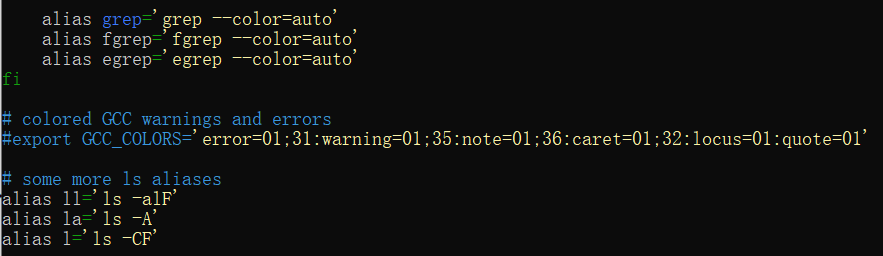

> 另外在 Shell 脚本中还有一些特殊的变量
>
> 比如 $# 表示传递给脚本或函数的位置参数的个数
>
> $? 上一个命令的返回值（退出状态码，0 通常表示没有错误，非 0 值表示有错误）
>
> $* 传递给脚本或函数的位置参数，双引号包围时作为一个整体
>
> $@ 传递给脚本或函数的位置参数
>
> $$ 当前 Shell 进程的进程 ID（PID）
>
> $! 最后一个后台命令的进程 ID
>
> $0 当前脚本的名称
>
> $1-n 脚本或函数的位置参数
>
> 这些变量在编写脚本的时候也会经常遇到

---

## Shell-03

> 我们回来继续编写这个猜数字的小游戏
>
> 需要生成一个 10 以内的随机数，然后让用户来猜这个数字
>
> 每次用户输入之后我们会给出一些提示：
>
> 如果猜对了游戏结束，猜错了游戏继续
>
> 我们会遇到新的问题：
>
> 第一，如何生成一个随机数
>
> 在 Linux 中有很多生成随机数的方法
>
> 比如可以使用 shuf 命令专门用来生成随机数，后面加上 -i 1-10 表示生成的范围，再加上 -n 1 表示生成的个数
>
> 每次执行之后的数字都是会变的
>
> 接下来把这个生成随机数的处理加入到脚本文件中，再把这个随机数赋值给变量 number
>
> 然后用 echo 命令打印这个变量（不要漏了 $）
>
> 执行脚本的时候报错了，提示找不到 -i 这个命令
>
> 这是因为当我们想要把一个命令的输出结果赋值给一个变量的时候
>
> 需要使用命令替换语法，也就是反引号 ` 或者 $() 把这个命令括起来
>
> 这样 Shell 才会把这个命令的输出结果当成一个整体来处理
>
> 提示：在使用命令替换语法的时候，尽量使用 $() 这种更加现代化的方式
>
> 在可读性和灵活性方面比反引号都更好
>
> 这样生成随机数的部分就完成了

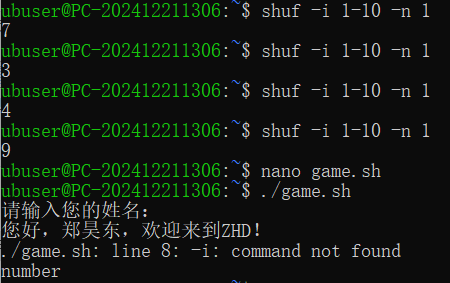

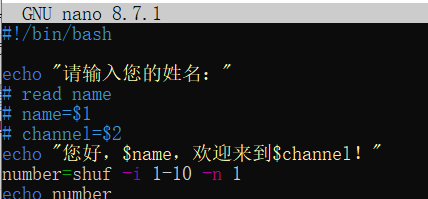

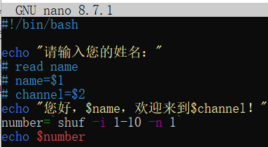

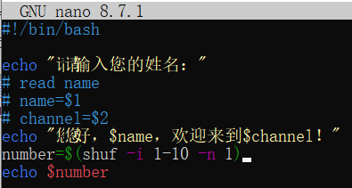

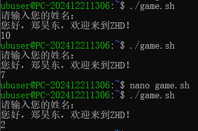

> 下面用 echo 命令打印提示信息，然后用 read 命令读取用户的输入并把它赋值给变量 guess
>
> 然后比较一下用户输入的数字和生成的随机数是否相等
>
> 如果相等的话就提示用户猜对了，否则就提示用户猜错了
>
> 这里就需要用到条件判断，也就是 if 语句，格式：
>
> if 后面加上一个条件，这个条件需要使用两个中括号括起来，后面再加上一个分号和 then
>
> 然后在下面加上一些命令，会在这个条件成立的时候被执行
>
> 最后再加上一个 fi 结束这个 if 语句
>
> if condition; then
>
> ​	要执行的语句
>
> fi
>
> 上面的 condition 可以是 []，[[]]，或者 (())：
>
> - [] 是最基本的条件测试表达式
> - [[]] 是扩展测试命令，提供了比 [] 更强大的功能
> - (()) 是数学表达式，支持常见的 +-*/ 等数学运算
>
> 如果用户猜错了我们也需要给出提示，可以在 if 语句下面再加上一个 else 分支

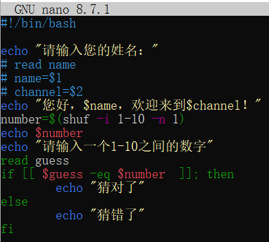

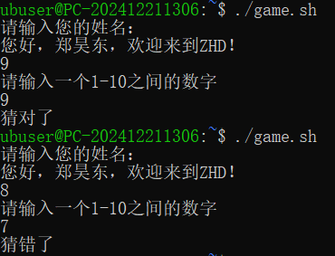

> 再来完善一下，如果用户猜错的时候给出一些提示，告诉用户猜的数字是大了还是小了
>
> 这里就需要使用到另外一种多分支的条件判断格式
>
> 可以在 if 和 else 分支之间加上一个 elif，然后在后面使用两个中括号，也加上一个条件
>
> 条件内容是如果用户输入的数字$guess 小于生成的随机数 $number 的话就打印输出“猜小了”的提示
>
> 最后一个 else 分支也就是用户猜大了的情况
>
> 这里小于符号是 -lt，大于符号是 -gt

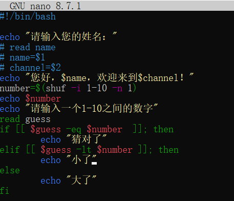

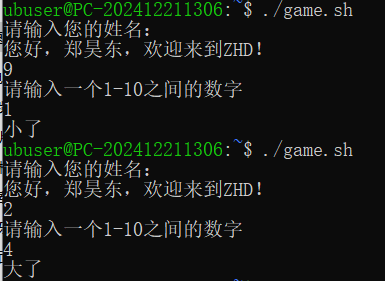

> 还有个问题：
>
> 这个脚本只能执行一次，猜错了就结束了
>
> 我们希望用户可以一直猜下去，直到猜对为止
>
> 这里就需要使用到循环了
>
> 在 Shell 脚本中有两种常用的循环
>
> 一种是 for 循环，一种是 while 循环
>
> for 循环可以遍历一些列表或者数组，while 循环则是在条件成立的情况下一直执行
>
> 这里使用 while 循环，后面加上两对中括号，在里面加上判断条件
>
> 条件的内容就是用户输入的数字 $guess 不等于生成的随机数 $number
>
> 只要用户没有猜对的话就一直循环
>
> 在 while 下面加上 do 表示循环的开始，后面加上 done 表示循环的结束
>
> 这样就完成了一个 while 循环

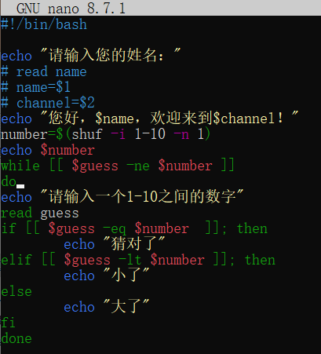

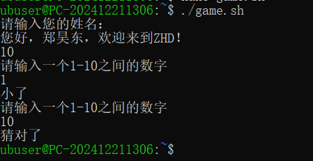

> 又有一个问题：每次猜对之后程序就直接结束了
>
> 我们希望用户可以自己选择是否继续
>
> 这里需要使用到新的语法：break 和 continue
>
> break 用来结束循环，continue 用来跳过循环
>
> 在用户猜对之后加上提示
>
> 然后使用 read 命令读取用户输入之后赋值给一个变量 choice
>
> 然后在下面使用一个 if 语句判断用户的选择
>
> 如果是 y 就继续（continue），是 n 就结束（break）
>
> 我们要修改 while 循环的条件为 true，一直为真，否则第一次猜中无论 choice 是什么，都会结束循环
>
> 注意 true 两边不需要加上中括号

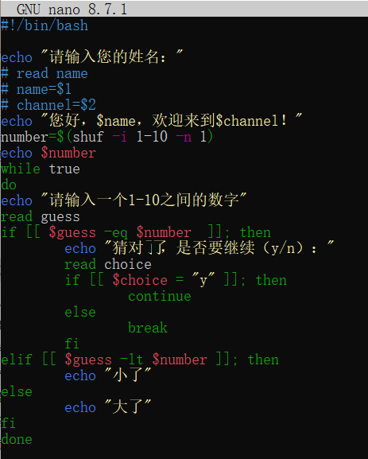

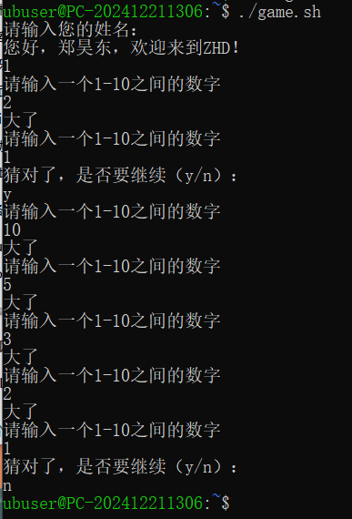

> 这里有个问题：用户输入 y 或者 n 是区分大小写的
>
> 修改一下判断条件，在 Shell 脚本中也可以像其他编程语言一样使用逻辑运算符来连接多个条件

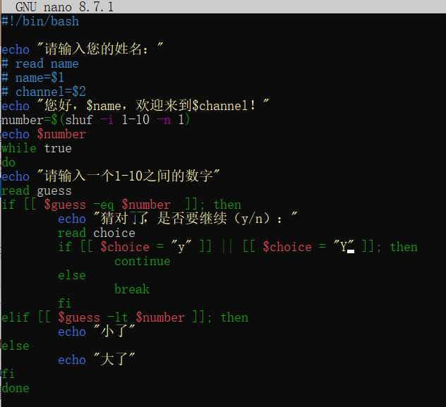

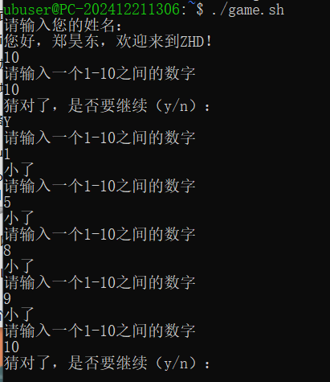

> 最后还有一个问题：每次继续之后，需要重新生成一个随机数
>
> 可以再复制一遍 shuf -i 1-10 -n 1
>
> 再介绍另一种方法：使用 $RANDOM 这个系统变量
>
> 这个变量会在每次调用的时候生成一个 0 到 32767 之间的随机数
>
> 每次用 echo 输出到命令行上都不一样
>
> 如果想要生成一个 1 到 10 之间的随机数，要加上取模运算，然后把整个表达式用两对小括号括起来
>
> 这样猜数字游戏就基本完成了

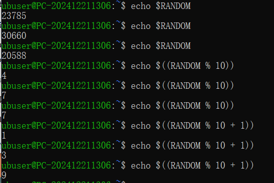

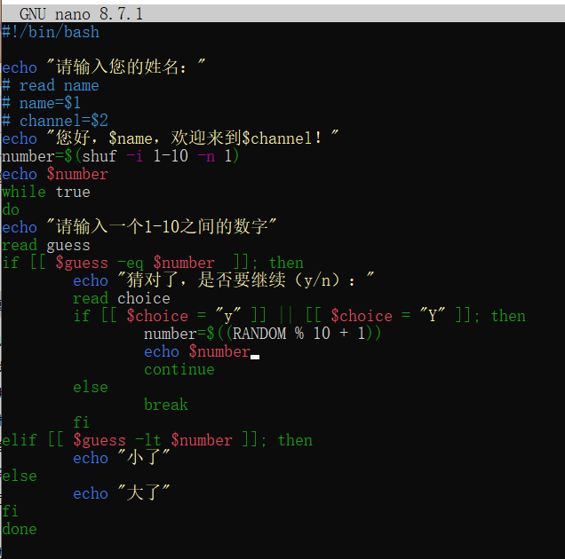

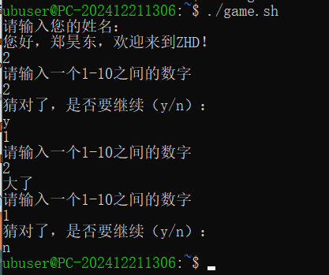

> 当然 Shell 脚本还可以做很多其他的事情
>
> 比如可以配合 grep awk 和 sed 等命令来进行文本处理
>
> 可以使用函数和数组这些高级语言才有的程序特性
>
> 也可以结合使用各种命令来进行系统管理和监控