# 正则表达式（Regular Expression）

## 简介

> 正则表达式可以精确第描述你想要匹配的字符组合
>
> 从而使得文本处理更加高效和灵活
>
> 在我们日常的很多场景中，都可以看到正则表达式的身影
>
> 比如在各种网站的注册页面中，会用到正则表达式来验证用户输入的信息是否符合规范
>
> 在 vi 或者 VSCode 这些常用的文本编辑软件中
>
> 也可以使用正则表达式来进行更高级的搜索和替换
>
> 在 Linux 和 Mac 系统中，也可以通过 grep 和 sed 等命令，来使用正则表达式进行文本处理

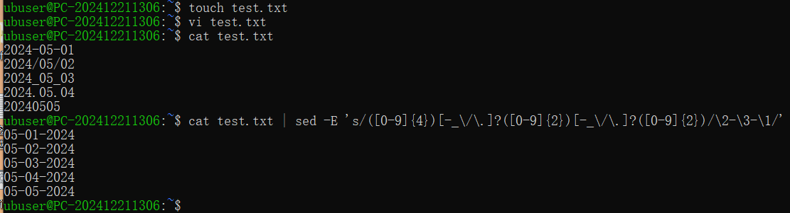

---

## 测试工具

> 在各种主流的编程语言中，也都提供了对正则表达式的支持
>
> 总的来说，正则表达式是一个非常有用的工具
>
> 下面是一个常用的工具，一个在线的正则表达式测试工具，可以帮助我们来测试和调试正则表达式，并且可以实时看到匹配的结果
>
> 可以帮助我们更好地学习和理解正则表达式

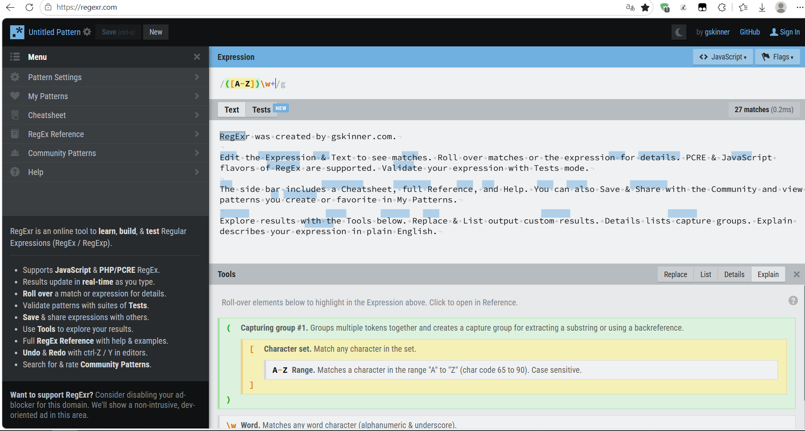

> 除了在线工具，VSCode 也对正则表达式提供了非常好的支持
>
> 在 VSCode 中打开一个文件之后，可以按下 Ctrl + F 或者 Command + F 快捷键来打开搜索框
>
> 点击搜索框右边的图标就可以打开或关闭正则表达式的搜索模式
>
> 打开之后就可以直接在编辑器中使用正则表达式来进行搜索了
>
> 另外，在扩展商店中还有一个叫做 Regex Previewer 的插件
>
> 可以帮助我们实时地预览正则表达式匹配结果
>
> 安装之后可以并排打开两个文件，一个用来输入正则表达式，另一边就可以实时看到匹配的结果
>
> 这个插件的优势是可以直接在编辑器中使用
>
> 但是它的功能相对来说比较简单，只能够显示匹配了还是没有匹配
>
> 相比在线工具的显示方面稍微逊色一些，但是对于一般的应用场景来说已经足够了
>
> 另外，如果有一定的 Python 编程基础的话
>
> 也可以使用 Python 的 re 模块来进行正则表达式的匹配

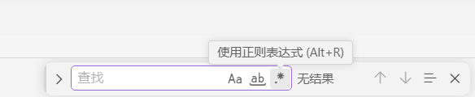

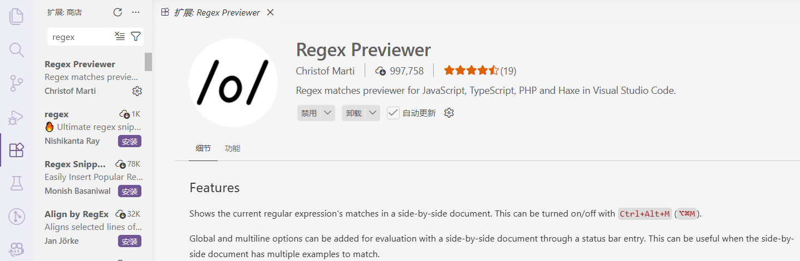

---

## 基础知识

> 正则表达式一般是用两个斜线 // 包裹起来的，后面可以跟上一些修饰符
>
> 比如 g 表示 global，也就是全局匹配的意思
>
> 还有 i 表示忽略大小写
>
> m 表示 多行匹配等
>
> 点击在线测试工具的 flag 按钮来查看和修改这些修饰符
>
> 先保持默认，后面再来详细介绍这些修饰符的含义

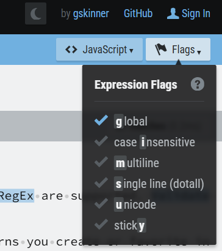

> 输入框里面已经有一个默认的正则表达式：/([A-Z])\w+/g
>
> 它会匹配所有的以大写字母开头的单词
>
> 现在清空输入 a，会看到下面高亮显示所有的 a
>
> 后面加上 t 就会显示所有的 at
>
> 如果想要匹配 at 后面加上任意一个字符的话
>
> 可以在后面加上一个点 .，点在正则表达式中表示除了换行符以外的任意一个字符
>
> 这个点可以放在任意的位置
>
> 比如放在开头就会匹配所有的以任意字符开头并且以 at 结尾的字符串
>
> 放在中间就会匹配所有的 a 和 t 之间只有一个字符的字符串

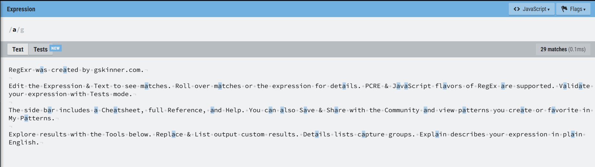

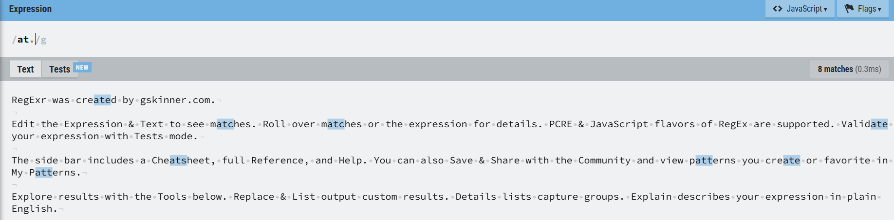

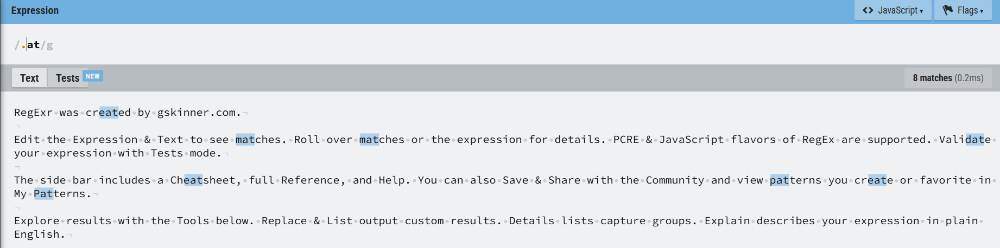

> 如果并不想要匹配所有的字符，只想匹配指定的几个字符的话
>
> 可以使用方括号 [] 表示一个字符集合
>
> 比如想要找到 at 后面跟着一个 c 或者 e 的字符串的话，就可以在 at 后面加上一个方括号
>
> 然后在方括号里面写上 c 和 e，这样就可以匹配到所有的 atc 和 ate
>
> 如果再加上一个 s，那也会匹配所有的 ats
>
> 除了字母之外，在方括号里面也可以加上一些数字或者其他字符
>
> 比如加上 0 就会匹配到所有的 at0
>
> 方括号里面除了可以使用单个字符以外，还可以使用一个中杆 - 来表示范围
>
> 比如把里面换成 a-z 的话，就可以表示从 a 到 z 的所有小写字母
>
> 加上大写的 A-Z 就是所有的大写字母
>
> 除了大小写以外，数字也是可以的

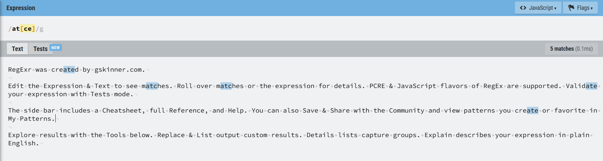

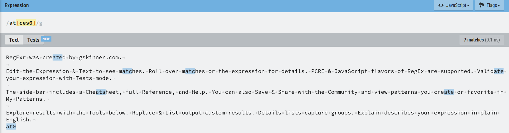

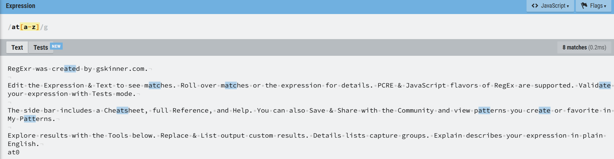

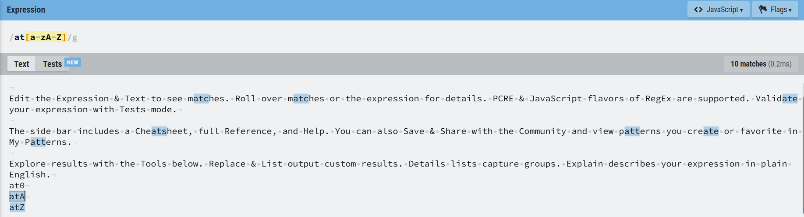

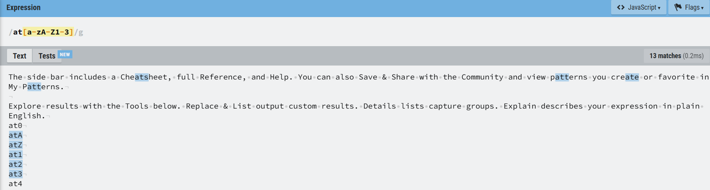

> 方括号里面还可以使用一个尖角号 ^ 来表示取反
>
> 比如在 a-z 的前面加上一个尖角号就表示除了小写字母之外的任意字符
>
> 在 A-Z 后面加上尖角号就是除了大写字母之外的任意字符
>
> 它们也可以组合起来使用，表示除了字母之外的任意字符
>
> 以上就是方括号的基本用法
>
> 方括号内可以写单个字符、范围或者使用尖角号来取反
>
> 注意：尖角号只有在方括号内部才表示取反
>
> 在方括号外部就表示匹配每一行的开头

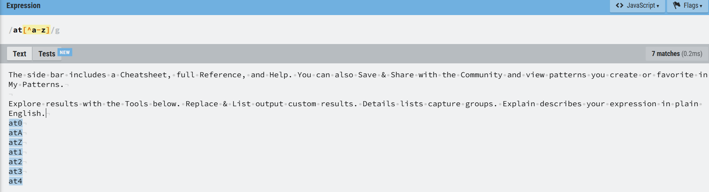

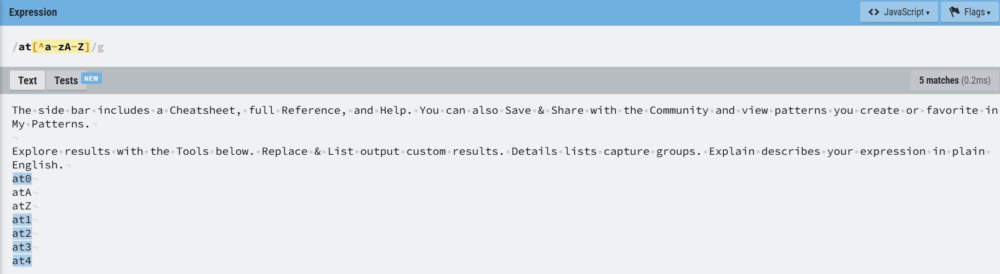

> 在正则表达式中，有很多场景是经常会遇到的
>
> 比如匹配数字、字母或者空白字符等
>
> 如果每次都要写一个方括号，然后写上一堆字符的话，就会显得非常繁琐
>
> 所以在正则表达式中提供了一些预定义的字符类，可以用来匹配一些常见的字符
>
> 比如 \d 就表示数字，它的作用和 [0-9] 是一样的
>
> 比如我们输入 at\d 的话，就可以匹配所有的 at 后面跟着一个数字的字符串
>
> 换成 \D 就表示非数字，可以匹配所有的 at 后面跟着一个非数字的字符串
>
> \w 表示字母、数字或者下划线
>
> 换成 \W 就是字母、数字或者下划线之外的任意字符，比如空白字符和一些特殊字符
>
> 最后还有一个常用的字符类是 \s，表示空白字符，也就是空格或者 Tab 等
>
> 换成 \S 就是非空白字符，也就是除了空格或者 Tab 之外的部分

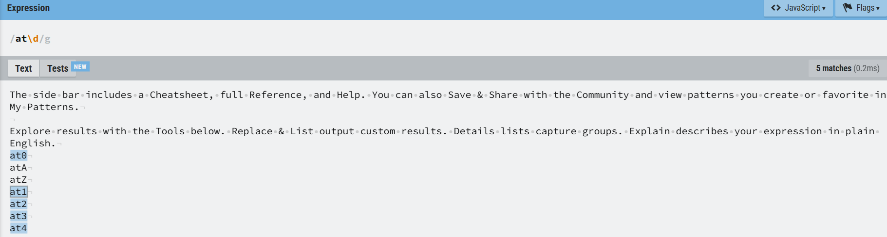

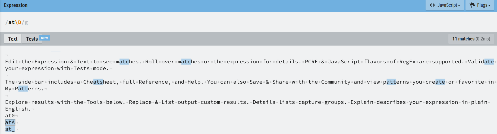

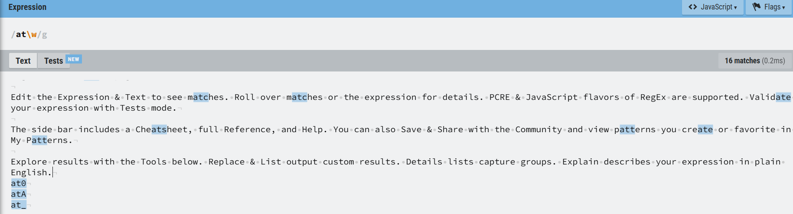

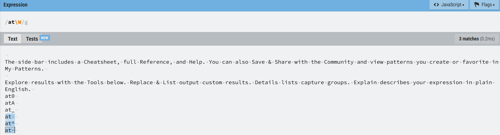

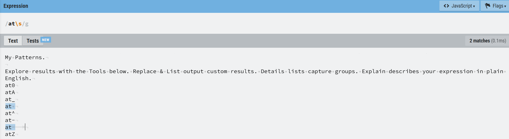

---

## 位置和边界匹配